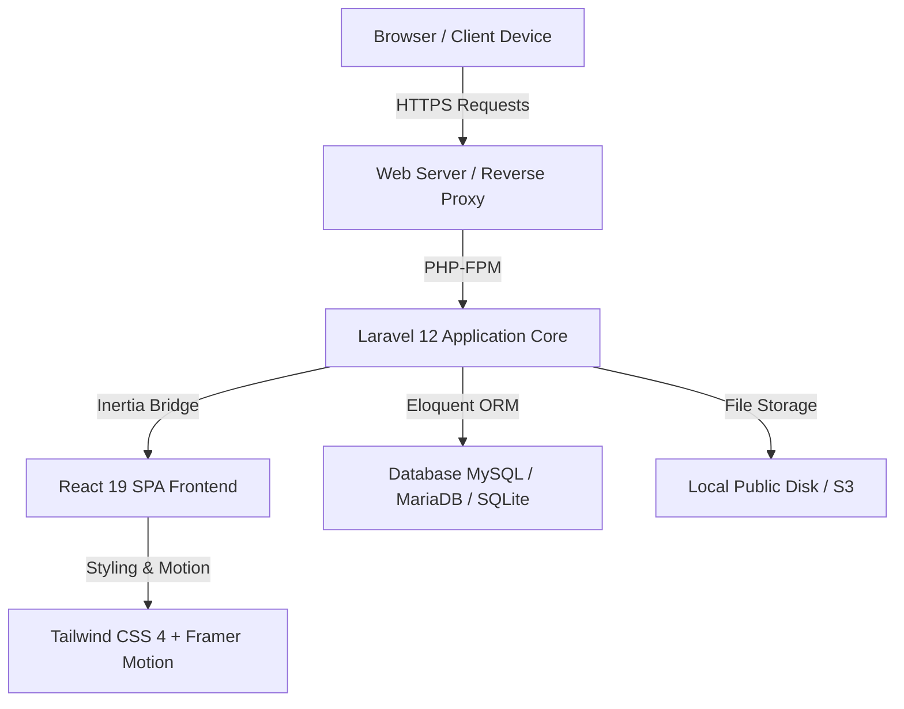

# Center of Excellence Smart Telecommunication & Autonomous System (CoE STAS-RG)
### Telkom University Research Group — Institutional Web Portal & Research Management System

[](https://laravel.com)
[](https://react.dev)
[](https://inertiajs.com)
[](https://www.typescriptlang.org)
[](https://tailwindcss.com)
[](https://vitejs.dev)
[](https://php.net)
[](LICENSE)

---

## 📑 Daftar Isi (Table of Contents)

1. [Tentang STAS-RG (About STAS-RG)](#-tentang-stas-rg-about-stas-rg)
2. [Fitur Utama (Key Features)](#-fitur-utama-key-features)
   - [A. Portal Publik (Public Web Portal)](#a-portal-publik-public-web-portal)
   - [B. Panel Administrasi (Admin Backoffice Portal)](#b-panel-administrasi-admin-backoffice-portal)
   - [C. Internasionalisasi & Dwi-Bahasa (Bilingual Architecture)](#c-internasionalisasi--dwi-bahasa-bilingual-architecture)
   - [D. Keamanan & Tata Kelola Data (Governance & Compliance)](#d-keamanan--tata-kelola-data-governance--compliance)
3. [Arsitektur & Teknologi (Tech Stack)](#-arsitektur--teknologi-tech-stack)
4. [Struktur Direktori (Directory Structure)](#-struktur-direktori-directory-structure)
5. [Prasyarat Sistem (System Requirements)](#-prasyarat-sistem-system-requirements)
6. [Panduan Instalasi (Installation & Setup)](#-panduan-instalasi-installation--setup)
7. [Konfigurasi Environment (.env)](#-konfigurasi-environment-env)
8. [Akun Administrator Default (Default Credentials)](#-akun-administrator-default-default-credentials)
9. [Daftar Perintah CLI (Available Commands)](#-daftar-perintah-cli-available-commands)
10. [Pemetaan Rute & Halaman (Route & Page Mapping)](#-pemetaan-rute--halaman-route--page-mapping)
11. [Panduan Deploy Produksi (Production Deployment)](#-panduan-deploy-produksi-production-deployment)
12. [Kontribusi & Pemeliharaan (Maintenance & Support)](#-kontribusi--pemeliharaan-maintenance--support)

---

## 🔬 Tentang STAS-RG (About STAS-RG)

**Center of Excellence Smart Telecommunication & Autonomous System Research Group (CoE STAS-RG)** adalah pusat unggulan riset dan inovasi multidisiplin di bawah naungan **Telkom University**. STAS-RG berfokus pada riset terapan mutakhir, pengembangan purwarupa industri, serta hilirisasi teknologi telekomunikasi pintar, jaringan nirkabel generasi lanjut (5G-Advanced & 6G), sistem otonom & robotika nirawak (UAV/UGV), Internet of Things (IoT), dan *Edge Artificial Intelligence*.

Repositori ini berisi kode sumber lengkap untuk platform web profil institusi, portal diseminasi publikasi ilmiah, katalog layanan konsultasi industri, serta portal manajemen data riset terintegrasi (Admin Backoffice).

---

## 🌟 Fitur Utama (Key Features)

### A. Portal Publik (Public Web Portal)

1. **Beranda Interaktif (Home Page)**
   - Hero banner modern dengan gradasi visual institusional bertema Emerald & Dark Green (`#107E27` / `#1AC13B` / `#0A1C12`).
   - Bar metrik riset dinamis (Citations, Scopus Publications, Active Grants, Industrial Partners).
   - Ringkasan profil laboratorium & kutipan resmi Ketua Laboratorium.
   - Showcase pilar domain riset utama dengan ikonografi responsif.
   - Filter proyek riset interaktif (All, Applied Telecom, Autonomous UAVs, AI/Edge, Smart IoT).
   - Highlight publikasi terindeks Scopus & jurnal bereputasi tinggi.
   - Katalog layanan pengujian teknis, konsultasi, dan kajian kelayakan industri.
   - Logo mitra industri, universitas global, dan lembaga kementerian (DPM, LPDP, BRIN, Kedaireka).
   - Warta riset terkini (*News & Insights*) dan agenda simposium (*Events & Masterclasses*).
   - Banner call-to-action resmi dilengkapi avatar Customer Support & Sekretariat Riset.

2. **Halaman Profil Lembaga (About Us / Tentang)**
   - Visi, misi, dan pilar strategis pengembangan laboratorium.
   - Metodologi riset empat tahap: *Problem Formulation*, *Mathematical Modeling*, *Hardware-in-the-Loop Prototyping*, hingga *Field Deployment*.
   - Dokumentasi fasilitas laboratorium dan perangkat uji frekuensi tinggi (SDR, Spectrum Analyzer, Drone Fleet, Anechoic Chamber).
   - Roadmap penelitian jangka menengah hingga 2030.

3. **Direktori Peneliti & Tim Ahli (Research Team Directory)**
   - Daftar Principal Investigator, Research Fellows, Postdoctoral Researchers, PhD Candidates, dan Research Engineers.
   - Tautan langsung ke profil ilmiah: Scopus ID, Google Scholar, ORCID, IEEE Xplore, ResearchGate, dan LinkedIn.
   - Pemetaan keahlian teknis (*Specialization Tags*) dan kontak email akademik.

4. **Katalog Domain & Bidang Riset (Research Domains)**
   - Penjelasan mendalam mengenai pilar riset (Next-Gen Wireless & Antenna, Autonomous Robotics, Cyber-Physical Systems, Edge AI).
   - Spesifikasi alat uji laboratorium terkait dan daftar publikasi unggulan per domain.

5. **Showcase Proyek Riset & Hibah (Research Projects & Grants)**
   - Galeri proyek riset lengkap dengan status (Active, Completed, Field Testing, Technology Transfer).
   - Informasi skema pendanaan (Hibah Nasional, Kedaireka Matching Fund, Dana Industri, Hibah Internal).
   - Level Kesiapterapan Teknologi (TRL / Tingkat Kesiapan Teknologi 1–9) dan tautan demo prototipe.

6. **Repositori Publikasi Ilmiah (Publications Repository)**
   - Pencarian & filter publikasi berdasarkan kuartil Scopus (Q1, Q2, Q3, Q4), SINTA (S1–S4), Konferensi IEEE, dan Paten/HKI.
   - Modal pembaca abstrak interaktif, DOI link resolver, sitasi BibTeX, dan tombol unduh PDF resmi.

7. **Layanan Kerjasama Industri & Konsultasi (Enterprise & Advisory Services)**
   - Paket layanan R&D industri: Uji Kepatuhan RF/Spektrum, Proof-of-Concept, Audit Keamanan Jaringan IoT, Konsultasi AI Edge.
   - Alur *engagement workflow* 4 tahap yang transparan dari *Scoping* hingga *Delivery*.
   - Formulir pengajuan proposal riset langsung (*Direct Inquiry Submission*).

8. **Jejaring Mitra Strategis (Strategic Partners & Alliances)**
   - Direktori mitra resmi lintas sektor: Operator Telekomunikasi, BUMN, Lembaga Pemerintah, dan Universitas Luar Negeri.
   - Klasifikasi kerjasama berdasarkan MoU (Nota Kesepahaman), MoA (Perjanjian Kerjasama), dan Joint Research Lab.

9. **Warta Riset & Publikasi (News & Research Insights)**
   - Artikel rilis ilmiah, perolehan hibah kompetitif, laporan partisipasi simposium, dan kunjungan delegasi internasional.
   - Filter kategori artikel, estimasi waktu baca (*reading time*), dan fitur pencarian kata kunci.

10. **Agenda Akademik & Workshop (Events & Symposia)**
    - Jadwal konferensi ilmiah, masterclass, lokakarya laboratorium, dan webinar hybrid.
    - Informasi pemateri (*speaker lineup*), lokasi kegiatan (*hybrid/offline/online*), dan link registrasi tiket.

11. **Tata Kelola, Etika & Kebijakan Hukum (Institutional Governance & Legal)**
    - **Kebijakan Privasi (Privacy Policy)**: Kepatuhan terhadap UU No. 27 Tahun 2022 tentang Pelindungan Data Pribadi (UU PDP) dan ISO/IEC 27001.
    - **Ketentuan Penggunaan (Terms of Use)**: Hak Kekayaan Intelektual (HKI), lisensi paten, dan etika akses laboratorium.
    - **Etika Akademik & Integritas Publikasi (Academic Ethics)**: Standar integritas riset, mitigasi plagiarisme, panduan COPE, dan sertifikasi *Ethical Clearance*.
    - **Peta Situs & XML Feeds (Sitemap)**: Direktori terstruktur dan feed XML untuk perayap Google Scholar, Scopus, dan SINTA.

12. **Hub Kontak & Kemitraan (Contact Hub)**
    - Formulir pesan resmi terhubung langsung ke database dan email sekretariat riset.
    - Lokasi laboratorium fisik di Telkom University Bandung (Gedung Riset Telkom University).
    - Kontak WhatsApp Sekretariat dan Email Resmi Direktorat PPM.

13. **Pencarian Global Instan (Search Modal)**
    - Pintasan keyboard `Ctrl + K` / `Cmd + K` untuk pencarian instan lintas seluruh modul (Domain, Proyek, Publikasi, Layanan).

---

### B. Panel Administrasi (Admin Backoffice Portal)

Akses penuh bagi pengelola laboratorium dan staf sekretariat melalui `/admin`:

| Modul Admin | Deskripsi & Kemampuan Fungsional |
| :--- | :--- |
| **Dashboard** | Statistik agregat metrik, grafik aktivitas, daftar pesan masuk terbaru (*Recent Inquiries*), dan status sistem. |
| **Team Management** | CRUD peneliti, unggah foto profil, ubah urutan tampil (*reorder*), *toggle active*, dan *toggle featured*. |
| **Domains Management** | CRUD bidang riset bilingual, input spesifikasi fokus area, alat laboratorium, dan ikonografi. |
| **Projects Management** | CRUD proyek riset, nominal hibah (*grant funding*), TRL, status pengerjaan, dan tautan live prototype. |
| **Publications Management** | CRUD publikasi, kuartil Scopus, penerbit jurnal/konferensi, DOI, jumlah sitasi, dan file naskah. |
| **Services Management** | CRUD paket layanan industri, estimasi SLA pengerjaan, dan *deliverable artifacts*. |
| **Partners Management** | CRUD mitra industri, unggah logo beresolusi tinggi, tipe kemitraan, dan URL website resmi. |
| **Articles Management** | CRUD artikel berita riset, editor konten bilingual, tag kategori, dan banner utama. |
| **Events Management** | CRUD agenda kegiatan, data narasumber, status pendaftaran (Open/Upcoming/Closed), dan link registrasi. |
| **Metrics Management** | CRUD indikator capaian riset utama dengan tombol *Sync Live* otomatis dari database. |
| **Inquiries Management** | Manajemen pesan masuk dari publik, filter status (*New*, *In Review*, *Contacted*, *Resolved*), dan pencatatan histori respon. |
| **Settings Management** | Pengaturan konfigurasi institusi (Nama Lab, Direktur, Alamat, Email, No. Telp, Akun Media Sosial, dan Tombol Clear Cache). |

---

### C. Internasionalisasi & Dwi-Bahasa (Bilingual Architecture)

Sistem mendukung alih bahasa dinamis secara *real-time* tanpa perlu memuat ulang halaman:
- **English (EN)**: Standar komunikasi riset internasional, mitra global, dan pengindeks ilmiah.
- **Bahasa Indonesia (ID)**: Standar komunikasi kepatuhan institusi, kementerian, dan industri nasional.
- Dikelola melalui kamus terstruktur di `resources/js/utils/translations.ts` serta kolom bilingual pada database (`title` / `title_id`, `summary` / `summary_id`, `description` / `description_id`).

---

### D. Keamanan & Tata Kelola Data (Governance & Compliance)

- **Proteksi Akses**: Autentikasi berbasis session Laravel dengan middleware keamanan ketat pada rute `/admin/*`.
- **Proteksi CSRF**: Token CSRF otomatis terintegrasi melalui Inertia.js dan Axios.
- **Sanitasi Data**: Validasi ketat pada seluruh Request Controller untuk mencegah injeksi SQL dan serangan XSS.
- **Fallback & Error Handling**: Halaman error kustom (403 Forbidden, 404 Not Found, 500 Server Error, 503 Maintenance) dengan tombol pemulihan kembali ke beranda dan pelaporan teknis.

---

## 🛠 Arsitektur & Teknologi (Tech Stack)



### Backend
- **Framework**: Laravel 12.x
- **Bahasa**: PHP 8.3+
- **Database ORM**: Eloquent ORM
- **Adapter SPA**: Inertia.js Laravel Adapter (`inertiajs/inertia-laravel`)
- **Autentikasi**: Laravel Session Guard & Bcrypt Hashing

### Frontend
- **Library Utama**: React 19.x
- **Type Safety**: TypeScript 5.x
- **Styling**: Tailwind CSS 4.x
- **Animasi UI**: Framer Motion 13.x
- **Ikonografi**: Lucide React
- **Build Tool**: Vite 6.x + Laravel Vite Plugin

---

## 📁 Struktur Direktori (Directory Structure)

```text
stasrg_profile/
├── app/
│   ├── Http/
│   │   ├── Controllers/
│   │   │   ├── Admin/                  # Controller CRUD Panel Admin
│   │   │   │   ├── ArticleController.php
│   │   │   │   ├── DashboardController.php
│   │   │   │   ├── DomainController.php
│   │   │   │   ├── EventController.php
│   │   │   │   ├── InquiryController.php
│   │   │   │   ├── MetricController.php
│   │   │   │   ├── PartnerController.php
│   │   │   │   ├── ProjectController.php
│   │   │   │   ├── PublicationController.php
│   │   │   │   ├── ResearcherController.php
│   │   │   │   ├── ServiceController.php
│   │   │   │   └── SettingController.php
│   │   │   ├── AuthController.php      # Autentikasi Admin (Login, Logout, Password)
│   │   │   ├── ErrorController.php     # Controller Halaman Error (404, 500, dll)
│   │   │   └── LandingPageController.php # Controller Seluruh Halaman Publik
│   │   └── Middleware/                 # Middleware Laravel & Inertia
│   └── Models/                         # Model Eloquent (User, Researcher, Domain, dll)
│       ├── Article.php
│       ├── Domain.php
│       ├── Event.php
│       ├── Inquiry.php
│       ├── Metric.php
│       ├── Partner.php
│       ├── Project.php
│       ├── Publication.php
│       ├── Researcher.php
│       ├── Service.php
│       ├── Setting.php
│       └── User.php
├── bootstrap/                          # Inisialisasi App & Konfigurasi Rute
├── config/                             # Konfigurasi Aplikasi (app, database, inertia, dll)
├── database/
│   ├── factories/                      # Factory Data Dummy
│   ├── migrations/                     # Skema Migrasi Database Lengkap
│   └── seeders/                        # Seeder Akun Administrator & Data Awal
├── public/
│   ├── assets/                         # Aset Gambar, Ikon, Avatar, dan Logo Resmi
│   │   ├── icon/                       # Ikon Menu, Customer Service, dan Error State
│   │   └── images/                     # Background Hero & Banner Institusi
│   └── build/                          # Aset Bundle Vite Hasil Kompilasi
├── resources/
│   ├── css/                            # File Style CSS Utama (Tailwind CSS v4)
│   │   └── app.css
│   ├── js/                             # Kode Sumber React + TypeScript
│   │   ├── Components/
│   │   │   ├── Common/                 # Komponen Reusable (Button, Modal, Card, Heading)
│   │   │   ├── Landing/                # Komponen Section Khusus Beranda
│   │   │   └── Layout/                 # Navbar, Footer, Breadcrumbs, Language Switcher
│   │   ├── Layouts/                    # Layout Template (AdminLayout)
│   │   ├── Pages/                      # Halaman Publik & Admin (Inertia Views)
│   │   │   ├── Admin/                  # Halaman CRUD Backoffice
│   │   │   ├── Auth/                   # Halaman Login & Reset Password
│   │   │   ├── About.tsx               # Halaman Tentang Kami
│   │   │   ├── AcademicEthics.tsx      # Halaman Etika Akademik
│   │   │   ├── Contact.tsx             # Halaman Hub Kontak & Kemitraan
│   │   │   ├── Error.tsx               # Halaman Error Dinamis
│   │   │   ├── Events.tsx              # Halaman Agenda & Workshop
│   │   │   ├── Home.tsx                # Halaman Beranda Utama
│   │   │   ├── News.tsx                # Halaman Warta Riset
│   │   │   ├── Partners.tsx            # Halaman Mitra Strategis
│   │   │   ├── PrivacyPolicy.tsx       # Halaman Kebijakan Privasi
│   │   │   ├── Projects.tsx            # Halaman Proyek & Hibah Riset
│   │   │   ├── Publications.tsx        # Halaman Repositori Publikasi
│   │   │   ├── Research.tsx            # Halaman Domain Riset
│   │   │   ├── Services.tsx            # Halaman Layanan Industri
│   │   │   ├── Sitemap.tsx             # Halaman Peta Situs
│   │   │   ├── Team.tsx                # Halaman Tim Peneliti
│   │   │   └── TermsOfUse.tsx          # Halaman Ketentuan Penggunaan
│   │   ├── types/                      # Deklarasi Tipe Data TypeScript
│   │   └── utils/                      # Kamus Terjemahan (translations.ts) & Helper
│   └── views/                          # Template Blade Root (app.blade.php)
├── routes/
│   ├── console.php                     # Rute Perintah Artisan CLI
│   └── web.php                         # Definisi Seluruh Rute Publik & Admin
├── storage/                            # Penyimpanan File Unggahan, Log, dan Sesi
├── .env.example                        # Contoh Konfigurasi Environment
├── composer.json                       # Dependensi Paket PHP
├── package.json                        # Dependensi Paket Node.js
├── tsconfig.json                       # Konfigurasi Kompiler TypeScript
└── vite.config.ts                      # Konfigurasi Bundler Vite
```

---

## 💻 Prasyarat Sistem (System Requirements)

Sebelum menjalankan aplikasi, pastikan sistem Anda telah memenuhi prasyarat berikut:

- **PHP**: Versi `>= 8.3` (dengan ekstensi: `pdo`, `pdo_mysql` / `pdo_sqlite`, `mbstring`, `openssl`, `tokenizer`, `xml`, `ctype`, `json`, `bcmath`, `fileinfo`)
- **Composer**: Versi `>= 2.7`
- **Node.js**: Versi `>= 20.x` (disarankan LTS)
- **NPM**: Versi `>= 10.x`
- **Database Engine**: MySQL `>= 8.0`, MariaDB `>= 10.6`, atau SQLite `>= 3.35`
- **Web Server (Produksi)**: Nginx / Apache dengan modul URL Rewriting aktif

---

## 🚀 Panduan Instalasi (Installation & Setup)

Ikuti langkah-langkah berikut untuk menginstal dan menjalankan proyek di lingkungan pengembangan lokal (*local development*):

### 1. Kloning Repositori
```bash
git clone https://github.com/fatintsani/stasrg-profile.git
cd stasrg-profile
```

### 2. Instal Dependensi Backend (PHP / Composer)
```bash
composer install
```

### 3. Instal Dependensi Frontend (Node.js / NPM)
```bash
npm install
```

### 4. Konfigurasi Environment File
Salin file template `.env.example` menjadi `.env`:
```bash
# Di Windows PowerShell:
copy .env.example .env

# Di Linux / macOS:
cp .env.example .env
```

### 5. Generate Application Encryption Key
```bash
php artisan key:generate
```

### 6. Konfigurasi Database pada `.env`
Buka file `.env` dan sesuaikan kredensial database Anda:
```env
DB_CONNECTION=mysql
DB_HOST=127.0.0.1
DB_PORT=3306
DB_DATABASE=stasrg_profile
DB_USERNAME=root
DB_PASSWORD=
```
*(Catatan: Jika menggunakan SQLite, atur `DB_CONNECTION=sqlite` dan pastikan file `database/database.sqlite` tersedia).*

### 7. Jalankan Migrasi Database & Seeder Data Awal
Eksekusi migrasi tabel dan buat akun administrator awal:
```bash
php artisan migrate --seed
```

### 8. Buat Symlink Storage (Penyimpanan File)
Pastikan folder storage publik terhubung:
```bash
php artisan storage:link
```

### 9. Jalankan Server Pengembangan (Dev Server)
Jalankan server backend Laravel dan Vite frontend secara bersamaan:

**Terminal 1 (Laravel Artisan Serve):**
```bash
php artisan serve
```
*(Aplikasi akan berjalan di `http://127.0.0.1:8000`)*

**Terminal 2 (Vite Hot Module Replacement):**
```bash
npm run dev
```

---

## ⚙️ Konfigurasi Environment (.env)

Berikut adalah variabel environment penting yang perlu disesuaikan:

```env
APP_NAME="CoE STAS-RG Telkom University"
APP_ENV=local
APP_KEY=base64:...
APP_DEBUG=true
APP_URL=http://localhost:8000
APP_TIMEZONE="Asia/Jakarta"
APP_LOCALE=id
APP_FALLBACK_LOCALE=en

# Konfigurasi Koneksi Database
DB_CONNECTION=mysql
DB_HOST=127.0.0.1
DB_PORT=3306
DB_DATABASE=stasrg_profile
DB_USERNAME=root
DB_PASSWORD=

# Konfigurasi Email Notifikasi (SMTP)
MAIL_MAILER=smtp
MAIL_SCHEME=null
MAIL_HOST=smtp.mailtrap.io
MAIL_PORT=2525
MAIL_USERNAME=null
MAIL_PASSWORD=null
MAIL_FROM_ADDRESS="secretariat@stas-rg.telkomuniversity.ac.id"
MAIL_FROM_NAME="${APP_NAME}"

# Konfigurasi Sesi & Cache
SESSION_DRIVER=database
SESSION_LIFETIME=120
CACHE_STORE=database
```

---

## 🔐 Akun Administrator Default (Default Credentials)

Setelah menjalankan `php artisan migrate --seed`, akun administrator berikut siap digunakan untuk mengelola panel admin:

- **URL Login Admin**: `http://127.0.0.1:8000/login`
- **Email**: `admin@stasrg.telu.ac.id`
- **Username**: `admin`
- **Password**: `password`
- **Hak Akses (Role)**: `principal_researcher` / Super Administrator

> **⚠️ PENTING UNTUK PRODUKSI**: Segera ubah email dan password default melalui menu **Admin > Settings** atau melalui Tinker setelah sistem dideploy ke server produksi.

---

## 📋 Daftar Perintah CLI (Available Commands)

| Perintah | Deskripsi |
| :--- | :--- |
| `npm run dev` | Menjalankan Vite dev server dengan Hot Module Replacement (HMR). |
| `npm run build` | Melakukan kompilasi aset produksi (TypeScript, CSS, Minifikasi JS). |
| `php artisan serve` | Menjalankan web server lokal Laravel. |
| `php artisan migrate` | Menjalankan seluruh migrasi database yang belum dieksekusi. |
| `php artisan migrate:fresh --seed` | Mengatur ulang database dari awal dan mengisi seeder default. |
| `php artisan optimize:clear` | Membersihkan seluruh cache (config, route, views, compiled classes). |
| `php artisan storage:link` | Membuat symbolic link dari `storage/app/public` ke `public/storage`. |
| `php artisan test` | Menjalankan suite pengujian unit test dan integration test. |

---

## 🗺 Pemetaan Rute & Halaman (Route & Page Mapping)

### Rute Halaman Publik

| Rute Utama | Rute Alternatif (ID) | Nama Rute | Komponen React | Deskripsi Halaman |
| :--- | :--- | :--- | :--- | :--- |
| `/` | - | `home` | `Pages/Home.tsx` | Beranda utama & showcase interaktif |
| `/about` | `/tentang` | `about` | `Pages/About.tsx` | Profil, visi misi, dan fasilitas lab |
| `/team` | `/tim` | `team` | `Pages/Team.tsx` | Direktori peneliti & Scopus/Scholar ID |
| `/research` | `/riset`, `/domains` | `research` | `Pages/Research.tsx` | Detail pilar domain riset |
| `/projects` | `/proyek` | `projects` | `Pages/Projects.tsx` | Galeri proyek & hibah riset |
| `/publications`| `/publikasi` | `publications`| `Pages/Publications.tsx` | Repositori jurnal Scopus & paten |
| `/services` | `/layanan` | `services` | `Pages/Services.tsx` | Katalog layanan & konsultasi industri |
| `/partners` | `/mitra` | `partners` | `Pages/Partners.tsx` | Jejaring mitra industri & universitas |
| `/news` | `/berita`, `/articles`| `news` | `Pages/News.tsx` | Artikel & warta riset terkini |
| `/events` | `/agenda` | `events` | `Pages/Events.tsx` | Jadwal masterclass & simposium ilmiah |
| `/privacy` | `/kebijakan-privasi` | `privacy` | `Pages/PrivacyPolicy.tsx` | Kebijakan privasi data & UU PDP |
| `/terms` | `/ketentuan` | `terms` | `Pages/TermsOfUse.tsx` | Syarat & ketentuan penggunaan HKI |
| `/ethics` | `/etika-akademik` | `ethics` | `Pages/AcademicEthics.tsx` | Pedoman integritas & komisi etik riset |
| `/sitemap` | `/peta-situs` | `sitemap` | `Pages/Sitemap.tsx` | Peta situs & direktori navigasi |
| `/contact` | `/kontak` | `contact` | `Pages/Contact.tsx` | Formulir kontak & permohonan MoU |

### Rute Autentikasi & Panel Admin

| Rute | Method | Nama Rute | Deskripsi |
| :--- | :--- | :--- | :--- |
| `/login` | `GET`, `POST` | `login`, `login.submit` | Halaman login & pemrosesan autentikasi |
| `/logout` | `GET`, `POST` | `logout` | Keluar dari sesi administrator |
| `/forgot-password`| `GET`, `POST`| `password.request` | Permohonan tautan reset password |
| `/reset-password/{token}`| `GET`, `POST`| `password.reset` | Formulir pembaruan password baru |
| `/admin/dashboard`| `GET` | `admin.dashboard` | Dashboard analitik & ringkasan backoffice |
| `/admin/team` | `GET`, `POST`, `PUT`, `DELETE` | `admin.team.*` | Manajemen peneliti & staf lab |
| `/admin/domains` | `GET`, `POST`, `PUT`, `DELETE` | `admin.domains.*` | Manajemen bidang/domain riset |
| `/admin/projects`| `GET`, `POST`, `PUT`, `DELETE` | `admin.projects.*` | Manajemen proyek, hibah, & TRL |
| `/admin/publications`| `GET`, `POST`, `PUT`, `DELETE` | `admin.publications.*`| Manajemen repositori publikasi & DOI |
| `/admin/services`| `GET`, `POST`, `PUT`, `DELETE` | `admin.services.*` | Manajemen layanan konsultasi industri |
| `/admin/partners`| `GET`, `POST`, `PUT`, `DELETE` | `admin.partners.*` | Manajemen mitra strategis & MoU |
| `/admin/articles`| `GET`, `POST`, `PUT`, `DELETE` | `admin.articles.*` | Manajemen artikel & berita riset |
| `/admin/events` | `GET`, `POST`, `PUT`, `DELETE` | `admin.events.*` | Manajemen agenda & simposium |
| `/admin/metrics` | `GET`, `POST`, `PUT`, `DELETE` | `admin.metrics.*` | Manajemen & sinkronisasi metrik live |
| `/admin/inquiries`| `GET`, `PUT`, `DELETE`, `PATCH` | `admin.inquiries.*` | Manajemen pesan masuk & status respon |
| `/admin/settings` | `GET`, `POST` | `admin.settings.*` | Konfigurasi profil pusat riset & cache |

---

## 🚢 Panduan Deploy Produksi (Production Deployment)

Untuk melakukan deploy pada server berbasis Linux (Ubuntu / Debian / AlmaLinux) dengan Nginx:

### 1. Build Aset Frontend
```bash
npm ci
npm run build
```

### 2. Optimasi Dependensi PHP
```bash
composer install --no-dev --optimize-autoloader
```

### 3. Cache Konfigurasi & Rute Laravel
```bash
php artisan config:cache
php artisan route:cache
php artisan view:cache
php artisan event:cache
```

### 4. Pastikan Izin Direktori Tepat
```bash
sudo chown -R www-data:www-data storage bootstrap/cache
sudo chmod -R 775 storage bootstrap/cache
```

### 5. Contoh Blok Konfigurasi Nginx
```nginx
server {
    listen 80;
    listen [::]:80;
    server_name stas-rg.telkomuniversity.ac.id;
    return 301 https://$host$request_uri;
}

server {
    listen 443 ssl http2;
    listen [::]:443 ssl http2;
    server_name stas-rg.telkomuniversity.ac.id;

    root /var/www/stasrg_profile/public;
    index index.php index.html;

    ssl_certificate /etc/ssl/certs/stas-rg.crt;
    ssl_certificate_key /etc/ssl/private/stas-rg.key;

    charset utf-8;
    client_max_body_size 64M;

    location / {
        try_files $uri $uri/ /index.php?$query_string;
    }

    location = /favicon.ico { access_log off; log_not_found off; }
    location = /robots.txt  { access_log off; log_not_found off; }

    error_page 404 /index.php;

    location ~ \.php$ {
        fastcgi_pass unix:/var/run/php/php8.3-fpm.sock;
        fastcgi_param SCRIPT_FILENAME $realpath_root$fastcgi_script_name;
        include fastcgi_params;
        fastcgi_hide_header X-Powered-By;
    }

    location ~ /\.(?!well-known).* {
        deny all;
    }
}
```

---

## 👥 Kontribusi & Pemeliharaan (Maintenance & Support)

Platform ini dikembangkan dan dipelihara oleh tim riset dan pengembang laboratorium **Center of Excellence Smart Telecommunication & Autonomous System (CoE STAS-RG)** Telkom University.

- **Institusi**: Telkom University Bandung, Jawa Barat, Indonesia
- **Fakultas / Pusat Riset**: Directorate of Research & Community Service (DPM)
- **Email Sekretariat**: [secretariat@stas-rg.telkomuniversity.ac.id](mailto:secretariat@stas-rg.telkomuniversity.ac.id)
- **Website Resmi**: [https://stas-rg.telkomuniversity.ac.id](https://stas-rg.telkomuniversity.ac.id)

---

<p align="center">
  <b>© 2026 Center of Excellence Smart Telecommunication & Autonomous System (CoE STAS-RG)</b><br>
  <i>Telkom University — Shaping the Future of Connectivity, Autonomy, and Smart Living.</i>
</p>
